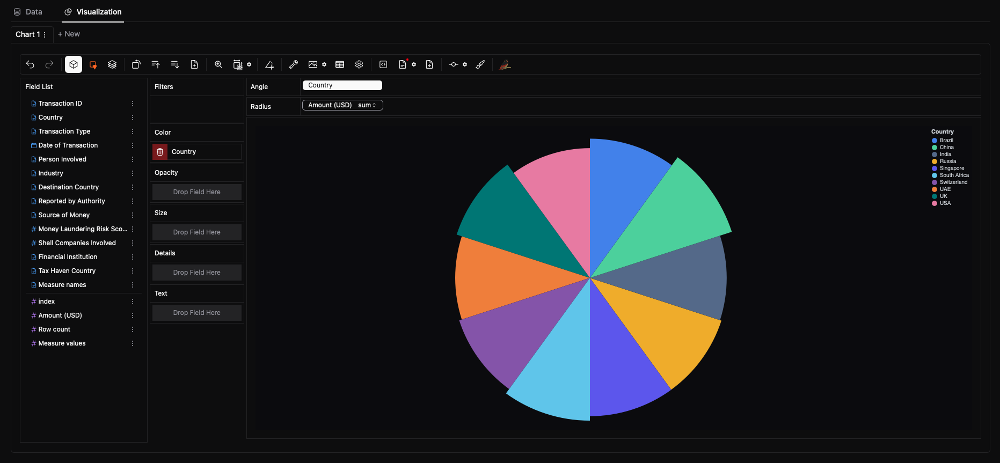

# Data.olllo — Next-Gen AI Data Analyst, Right on Your Desktop

**Data.olllo** is a next-generation, privacy-first data tool for working with large CSV, Excel, and database files **locally**.

- 🔐 **Privacy First** — No cloud, no upload — all processing stays on your machine.
- ⚡ **Lightning Fast** — Handles millions or even 100 GB+ rows with blazing speed.
- 🎨 **Intuitive** — Visualize, clean, and transform data with one-click tools.
- 🤖 **AI Assistant** — Generate pandas, plotly, and p5.js code you can trust and control — fully local, no data exposure online.

---

## 💻 Screenshots

---

## 📦 Features

- ✅ No-code interface for CSV, Excel, JSON, and SQL data  
- 🧠 Local processing using **Pandas**, **Polars**, or **Vaex**  
- 📊 Charting, profiling, filtering, merging, and interactive visualization  
- 🤖 Built-in AI assistant for cleaning, transformation, regex, datetime formatting, merging, deduplication, and visualization  
- 🗃️ Integrated SQLite engine for fast data storage and querying  
- 🔒 AI-generated code is **transparent, editable, and reproducible**  

---

## 🚀 Get Started

1. [Download Data.olllo](https://olllo.top/data.olllo)  
2. Run the app (no installation required)  
3. Load your dataset and start exploring  

---

## 🧠 Example: AI-Powered Data Analysis

---

## 🔗 Main Resources

### 📦 Core Pages
- 🌐 [Homepage](https://olllo.top/)  
- 📥 [Download Data.olllo](https://olllo.top/data.olllo)  
- 💰 [Pricing](https://olllo.top/pricing)  
- 📬 [Contact](https://olllo.top/contact)  
- 👤 [About](https://olllo.top/about)  
- 🔒 [Privacy Policy](https://olllo.top/privacy)  
- 🛡️ [Privacy & Compliance](https://olllo.top/privacy-compliance)  

### 🤖 AI Features
- 🤖 [Data.olllo AI](https://olllo.top/data.olllo.ai)  
- 📘 [Data.olllo AI Guide](https://olllo.top/data.olllo.ai_guide)  
- 📊 [AI CSV Analysis](https://olllo.top/AI-CSV-Analysis)  
- 🧹 [AI-Powered Data Cleaning and Analysis Assistant](https://olllo.top/AI-Powered-Data-Cleaning-And-Analysis-Assistant)  
- 📈 [How to Visualize Data with AI Chat](https://olllo.top/How-to-Visualize-Data-with-Data.olllo-AI-Chat)  
- ⏰ [Convert Datetime with AI Chat](https://olllo.top/convert-format-datetime-ai-chat)  
- 🔎 [String Regex with AI Chat](https://olllo.top/string-regex-ai-chat)  
- 📄 [Remove Duplicates](https://olllo.top/remove-duplicates)  
- 🔗 [Merge Excel Files](https://olllo.top/merge-excel-files)  
- 🧑‍💻 [Trusted AI Code](https://olllo.top/trusted-ai-code)  

### 📑 Documentation & Guides
- 📚 [Docs & Articles](https://olllo.top/articles)  
- 📘 [Data.olllo User Guide](https://olllo.top/articles/article-0-Data.olllo-UserGuide)  
- 📘 [Data.olllo.AI User Guide](https://olllo.top/articles/article-25-Data.olllo.AI-UserGuide)  

### 📖 Articles & Tutorials (Highlights)
- 🚀 [Version 6.0 Release](https://olllo.top/articles/article-1-Data.olllo-Version-6.0-Release)  
- 📂 [How to Open Large Data Files](https://olllo.top/articles/article-2-How-to-Open-Large-Data-Files)  
- 📊 [Data.olllo vs Excel](https://olllo.top/articles/article-18-Data.olllo-vs-Excel)  
- 📊 [Why Excel Users Love Data.olllo](https://olllo.top/articles/article-21-Why-Excel-Users-Love-Data.olllo)  
- 💥 [Tired of Crashing Spreadsheets](https://olllo.top/articles/article-22-Tired-of-Crashing-Spreadsheets.olllo)  
- 🏎 [Opening 100GB CSV](https://olllo.top/articles/article-19-Opening-100GB-CSV)  
- ✂️ [Split Huge CSVs in Seconds](https://olllo.top/articles/article-24-Split-Huge-CSVs-in-Seconds)  
- 🧩 [Merge, Clean, Transform Data (No-Code)](https://olllo.top/articles/article-26-Merge-Clean_and_Transform-Data-Using-Natural-Language-No-Coding-Needed)  
- 🔮 [Future of Data Analysis with AI](https://olllo.top/articles/article-27-Navigating-the-Future-of-Data-Analysis-Embrace-AI-to-Stay-Ahead)  

### 🛠 Utilities & Specialized Tools
- 🧩 [No-Code CSV Viewer & Editor (Offline)](https://olllo.top/no_code_csv_viewer_editor_offline)  
- 🗂 [Open Large CSV Files Offline](https://olllo.top/open_large_CSV_file_offline)  
- ✂️ [CSV Splitter](https://olllo.top/csv-splitter)  
- 📊 [Excel Alternative for Large Datasets](https://olllo.top/excel-alternative-for-large-datasets)  
- 🛠 [Excel Crash Solution](https://olllo.top/excel-crash-solution)  
- 💡 [No Coding Needed](https://olllo.top/no-coding-needed)  

---

## 📝 License

This repository is licensed under the MIT License. See the [LICENSE](LICENSE) file for more details.