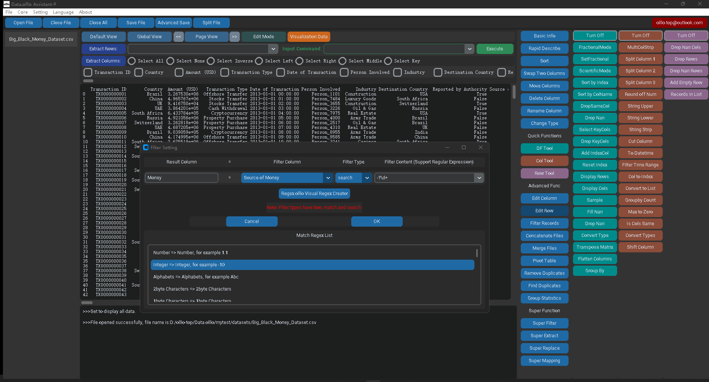

# Data.olllo — Instantly Open, Clean, and Visualize Massive Data

**Data.olllo** is a fast and privacy-focused data tool for working with large CSV and Excel files **locally**.

- 🔐 **Privacy First** — No cloud, no upload — all processing stays on your machine.
- ⚡ **Lightning Fast** — Handles millions of rows with blazing speed.
- 🎨 **Intuitive** — Visualize, clean, and export data with one-click tools.

---

## 💻 Screenshots

---

## 📦 Features

- ✅ No-code interface for CSV, Excel, and SQL data
- 🧠 Local processing using **Pandas**, **Polars**, or **Vaex**
- 📊 Charting, profiling, filtering, merging, and more
- 🤖 AI assistant powered by [ChatGPT API](https://openai.com)
- 🗃️ Built-in SQLite data storage engine

---

## 🚀 Get Started

1. [Download Data.olllo](https://olllo.top/data.olllo)
2. Run the app (no installation required)
3. Load your dataset and start exploring

---

## 🧠 Example: Quick Data Analysis

<video src="screenshots/explore.mp4" controls width="600">
  Your browser does not support the video tag.
</video>

---

## 🔗 Related Resources

- 🌐 [Official Site – Instantly Open, Clean, and Visualize Massive Data](https://olllo.top)  
  No code. No cloud. Just click—analyze 100 GB+ CSV, Excel, or JSON files in seconds, privately on your desktop.

- 📥 [Download App Page – Data.olllo](https://olllo.top/data.olllo)

- 🧩 [No-code CSV Viewer & Editor Offline](https://olllo.top/no_code_csv_viewer_editor_offline)

- 💾 [How to Open Large CSV Files Offline](https://olllo.top/open_large_CSV_file_offline)

- 📊 [Excel Alternative for Large Datasets](https://olllo.top/excel-alternative-for-large-datasets)

- 🤖 [AI-Powered Data Cleaning and Analysis Assistant](https://olllo.top/AI-Powered-Data-Cleaning-And-Analysis-Assistant)

- ✂️ [Split Huge CSVs in Seconds – Article #24](https://olllo.top/articles/article-24-Split-Huge-CSVs-in-Seconds)

---

## 📝 License

This repository is licensed under the MIT License. See the [LICENSE](LICENSE) file for more details.
